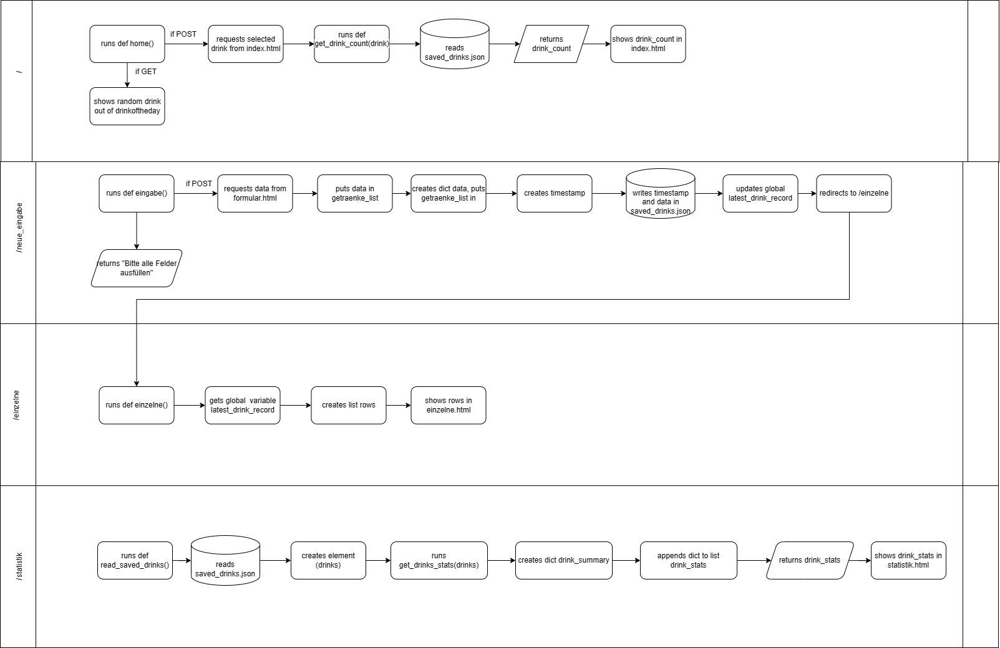

#  Promillebrille - *Deine Promilledokumentation*

## Warum dieses Projekt
Meine Projektidee umfasst ein Tool, um zu testen, wie viel Alkohol man nach einer gewissen Anzahl Getränke im Blut hat.
Der Grund für dieses Projekt war, eine Plattform zu haben, welche mir anzeigt, wie oft ich Alkohol trinke und wie 
hoch mein Promillewert jeweils ist. 

## Welches Problem löst das Projekt
Das Projekt löst das Problem des Unwissens des Promillewerts, wenn man Alkohol trinkt. Zudem löst es das Problem
fehlender Dokumentation des Alkoholkonsums. 

## Was macht das Projekt
Das Projekt bietet die Möglichkeit, die konsumierten alkoholischen Getränke zu erfassen und zu dokumentieren. Dabei
wird sofort berechnet, wie hoch der aktuelle Promillegehalt im Blut ist. Das Projekt nimmt die Getränke entgegen, 
berechnet den Promillegehalt pro Getränkeart, speichert den Gesamtpromillegehalt und dokumentiert diesen zusammen mit dem 
aktuellen Tagesdatum in einer Tabelle und in einem Graph. 

## Betrieb
Um das Projekt auszuführen, muss die Datei "main.py" ausgeführt werden. Promillebrille verwendet Plotly. Dies muss vor Benutzung 
installiert werden. Sonst wird die Grafik nicht angezeigt. Das Projekt läuft über den Port 5001. 
Wenn auf diesem Port andere Dinge ausgeführt werden, sollte das geändert werden, um Komplikationen zu vermeiden.
Information zu den Kommentaren: Die Kommentare sind auch beschreibender Natur, weil ich den Code und seine einzelnen Berechnungen besser verstehe. 

## Wie wird das Projekt benutzt
Nachdem main.py ausgeführt wurde, gelangt man auf die auf die Startseite. Diese wird **home** genannt. 
In der Navigation werden folgende Seite angezeigt: Home, Neue Eingabe, Statistik, Einzelne Auswertungen. 
Auf der **Startseite** kann der User bereits einige Informationen erhalten. So wird ihm mit einer Zufallsfunktion das Getränk des Tages angezeigt. 
Zudem kann der User ersehen, wie viel Getränke einer Art er bereits im Programm gespeichert hat bzw. getrunken hat. 
Über den blauen Button "Neues Getränk" kann der User eingeben, was er gerade getrunken hat. 

Auf der Seite **neue Eingabe** kann der User seine persönlichen Daten und die konsumierten Getränke eingeben. Durch diese Angaben kann der etwaige Promillegehalt
berechnet werden. Der User kann zwischen 4 verschiedenen Getränkearten auswählen: Bier, Wein, Sekt und Schnaps. Durch das Klicken auf Absenden wird der
Promillegehalt je Getränk berechnet und der User wird automatisch auf die Seite **Einzelne Auswertung** weitergeleitet. Wird ein Feld nicht ausgefüllt, erscheint die Meldung, dass alle Felder ausgefüllt werden müssen.  

Auf der Seite **Einzelne Auswertung** wird dem User angezeigt, wie viele Getränke pro Getränkeart er konsumiert hat und wie viel Promille jede Getränkeart aktuell in sein Blut geführt hat. Wird **Einzelen Auswertung** über die Navigationsbar aufgerufen, bevor Getränke eingegeben wurden, wird folgender Satz angezeigt: **Noch sind keine Getränke vorhanden**. Zudem erscheint der blaue Button wie auf der Startseite ("Neues Getränk"). 

Auf der Seite **Statistik** werden die einzelnen Getränke- und Promilledatei addiert und als Momentaufnahme je Timelineeintrag gespeichert. Hier sieht der User also die Gesamtzahl an Getränke und die daraus folgende Promilleanzahl. Zudem wird ihm ein Graph angezeigt. Dieser zeigt die History der Trinkdaten und der Anzahl Getränke. Wurden beispielsweise an einem Tag 15 Bier, 4 Sekt und 2 Gläser Wein getrunken, zeigt der Graph 21 Getränke an diesem Tag an. 

## Was wurde nicht gelöst
Es war mir nicht möglich, zu programmieren, dass nicht jedes Feld der Getränke auf der Seite **neue Eingabe** ausgefüllt werden muss. Dies muss noch verbessert werden. Zudem möchte ich noch verbessern, dass bei mehreren Eingaben am gleichen Tag die Getränke und Promillewerte addiert werden und dem Graph übergeben werden. Aktuell werden diese einzeln angezeigt, was zu einer Verfälschung der Statistik führt. 

## Folglich wird die Architektur meiner Seite aufgezeigt:

